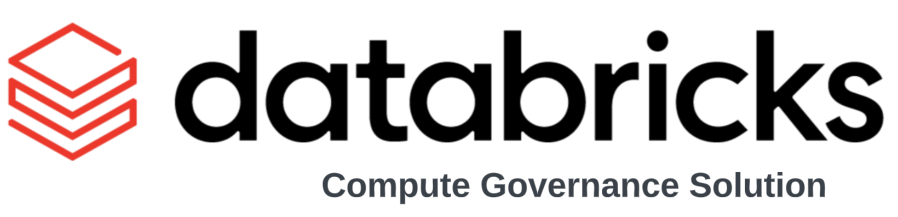
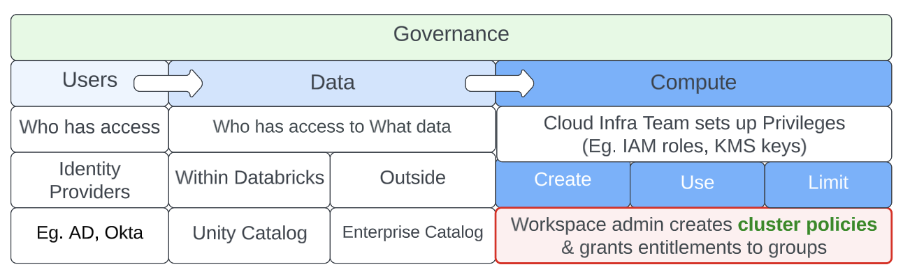
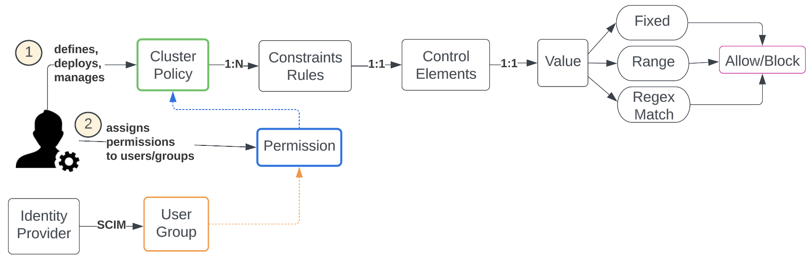
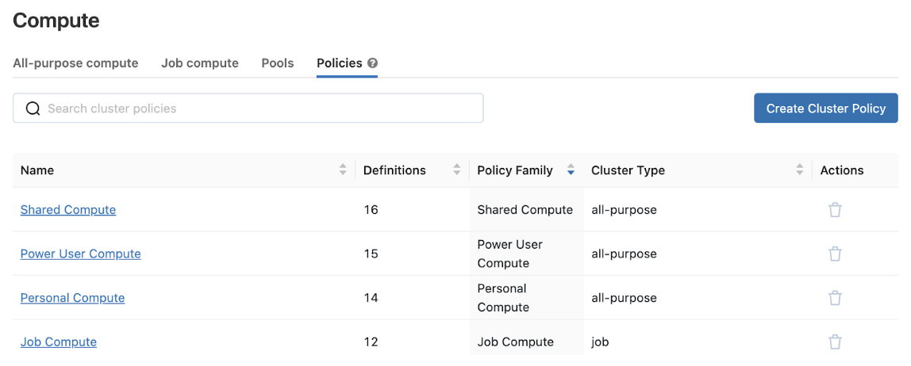
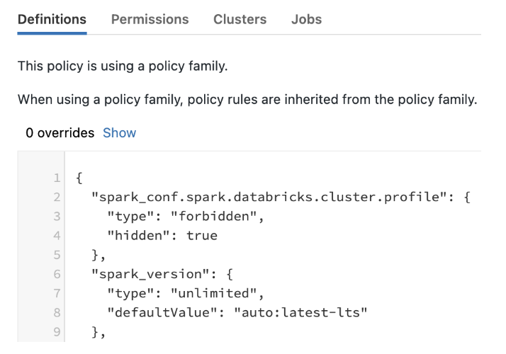
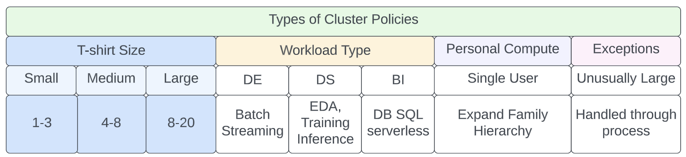
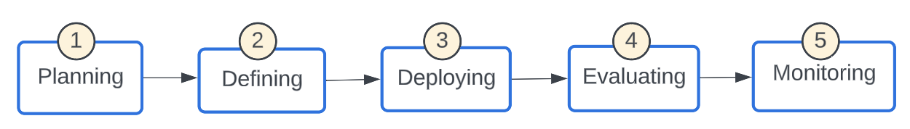
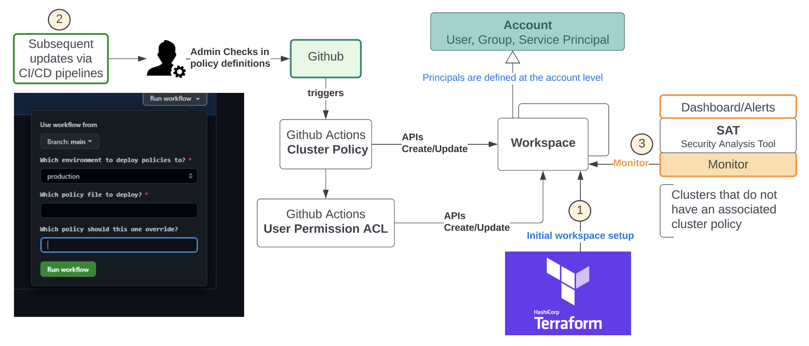

* <b>Domain </b>: Governance 
* <b>Challenge </b>: Control unnecessary wastage of compute resources by proper guardrails that democratize access to data to only privileged principals
___
Data becomes useful only when it is converted to insights. Data democratization is the self-serve process of getting data into the hands of people that can add value to it without undue process bottlenecks and without expensive and embarrassing faux pas moments. Governance is needed to avoid anarchy for users, ensuring correct access privileges not only to the data but also to the underlying compute needed to crunch the data. 
Governance of a data platform can be broken into 3 main areas - Governance of Users, Data & Compute  

Governance of users ensures the right entities and groups have access to data and compute and enterprise-level identity providers usually enforce this. Governance of data determines who has access to what datasets at the row and column level. Enterprise catalogs and Unity Catalog help enforce that. The most expensive part of a data pipeline is the underlying compute. It usually requires the cloud infra team to set up privileges to facilitate access, after which Databricks admins can set up cluster policies to ensure the right principals have access to the needed compute controls.

# Benefits of Cluster Policy
Cluster Policies serve as a bridge between users and the cluster usage-related privileges that they have access. Simplification of platform usage and effective cost control are the two main benefits of cluster policies. Users have fewer knobs to try leading to fewer inadvertent mistakes, especially around cluster sizing. This leads to better user experience, improved productivity, security,  and administration aligned to corporate governance. Setting limits on max usage per user, per workload, per hour usage, and limiting access to resource types whose values contribute to cost helps to have predictable usage bills. Eg. restricted node type, DBR version with tagging & autoscaling

# Cluster Policy Definition
On Databricks, there are several ways to bring up compute resources - from the Clusters UI, Jobs launching the specified compute resources, and via REST APIs.  
A Databricks admin is tasked with creating, deploying, and managing cluster policies to define rules that dictate conditions to create, use, and limit compute resources at the enterprise level. Typically, this is adapted and tweaked by the various Lines of Business (LOBs) to meet their requirements and align with enterprise-wide guidelines. There is a lot of flexibility in defining the policies as each control element offers several strategies for setting bounds.

## Cluster Families
There are standard cluster policy families that are provided out of the box at the time of workspace deployment (These will eventually be moved to the account level) and it is strongly recommended to use them as a base template. When using a policy family, policy rules are inherited from the policy family. A policy may add additional rules or override inherited rules.  

The ones that are currently offered include 
* Personal Compute & Power User Compute (single user using all-purpose cluster)
* Shared Compute (multi-user, all-purpose cluster)
* Job Compute (job Compute)

* Clicking into one of the policy families, you can see the JSON definition ad any overrides to the base, permissions, clusters & jobs with which it is associated.

### Creating Cluster Policies for the enterprise
* Platform Team
* Create base cluster policies
* Assign policy preferably to groups

* Users will see only those policies that they have been assiged
* LOBs
* Marketing
* Finance
* Sales

* Use the centrally defied policies, tweak some, add some new ones

#### Groups
* Data Engineer
* Data Scientist
* BI Analyst

###### Example Policies

* Available for all with controlled usage
* base_single_user.json

* Available for all for generic use in any environment
* base_small.json 

* Available by size and persona
* base_de_small.json
* base_ml_medium.json

## Available by LOB, environment, persona, size  
* mkt_dev_analyst_medium.json
* mkt_prod_analyst_medium.json

# Rolling out Cluster Policies in an enterprise

<b>Planning: </b> Articulate enterprise governance goals around controlling the budget, and usage attribution via tags so that cost centers get accurate chargebacks, runtime versions for compatibility and support requirements, and regulatory audit requirements. The unspecified cluster policy provides a backdoor route for bypassing the cluster policies and should be suppressed. The process should handle exception scenarios eg. requests for an unusually large cluster using a formal approval process. Key success metrics should be defined so that the effectiveness of the cluster policies can be quantified.  
A good naming convention helps with self-describing and management needs so that a user instinctively knows which one to use and an admin recognizes which LOB it belongs to. For eg. mkt_prod_analyst_med denotes the LOB, environment, persona, and t-shirt size.  
<b>Defining: </b> Admins should create a set of base cluster policies that are inherited by the LOBs and adapted.  
<b> Deploying: </b> Cluster Policies should be carefully considered prior to rollout. Frequent changes are not ideal as it confuses the end users and does not serve the intended purpose. There will be occasions to introduce a new policy or tweak an existing one and such changes are best done using automation. Once a cluster policy has been changed, it affects new compute spun subsequently. There may be older clusters running with the old policy and the ‘Clusters’ tab will help identify the old ones (Which clusters are out of sync) in case the owners need to be notified of the change. 
<b>Evaluating: </b> The success metrics defined in the planning phase should be evaluated on an ongoing basis to see if some tweaks are needed both at the policy and process levels.  
<b> Monitoring:</b> Periodic scans of clusters should be done to ensure that no cluster is being spun up without an associated cluster policy.  

# Cluster Policy Management & Automation
Cluster policies are defined in JSON using the Cluster Policies API 2.0 and Permissions API 2.0 (Cluster policy permissions) that manage which users can use which cluster policies.  It supports all cluster attributes controlled with the Clusters API 2.0 along with additional synthetic attributes such as max DBU-hour, and a limit on the source that creates a cluster. 

* Terraform can be used to deploy a new workspace and the initial policy definitions
* Subsequent updates to policy definitions across workspaces should be managed by admin personas using CI/CD pipelines. The diagram above shows Giithub workflows managed via Github actions to deploy policy definitions ad the associated user permissions into the chosen workspaces
* REST APIs can be leveraged to monitor clusters in the workspace either explicitly or implicitly using the SAT tool to ensure enterprise-wide compliance.

# Serverless
In the absence of a serverless architecture, cluster policies are managed by admins to expose control knobs to create, manage and limit compute resources. Serverless will likely alleviate this responsibility off the admins to a certain extent. Regardless, these knobs are necessary to provide flexibility in the creation of compute to match the specific needs and profile of the workload.

# Setup Github Workflow 

___
<anindita.mahapatra@databricks.com>  
<stephen.carman@databricks.com>
___

&copy; 2022 Databricks, Inc. All rights reserved. The source in this notebook is provided subject to the Databricks License [https://databricks.com/db-license-source].  All included or referenced third party libraries are subject to the licenses set forth below.

## Getting started

Although specific solutions can be downloaded as .dbc archives from our websites, we recommend cloning these repositories onto your databricks environment. Not only will you get access to latest code, but you will be part of a community of experts driving industry best practices and re-usable solutions, influencing our respective industries. 

To start using a solution accelerator in Databricks simply follow these steps: 

1. Clone solution accelerator repository in Databricks using [Databricks Repos](https://www.databricks.com/product/repos)
2. Attach the `RUNME` notebook to any cluster and execute the notebook via Run-All. A multi-step-job describing the accelerator pipeline will be created, and the link will be provided. The job configuration is written in the RUNME notebook in json format. 
3. Execute the multi-step-job to see how the pipeline runs. 
4. You might want to modify the samples in the solution accelerator to your need, collaborate with other users and run the code samples against your own data. To do so start by changing the Git remote of your repository  to your organization’s repository vs using our samples repository (learn more). You can now commit and push code, collaborate with other user’s via Git and follow your organization’s processes for code development.

The cost associated with running the accelerator is the user's responsibility.

## Project support 

Please note the code in this project is provided for your exploration only, and are not formally supported by Databricks with Service Level Agreements (SLAs). They are provided AS-IS and we do not make any guarantees of any kind. Please do not submit a support ticket relating to any issues arising from the use of these projects. The source in this project is provided subject to the Databricks [License](./LICENSE). All included or referenced third party libraries are subject to the licenses set forth below.

Any issues discovered through the use of this project should be filed as GitHub Issues on the Repo. They will be reviewed as time permits, but there are no formal SLAs for support. 
