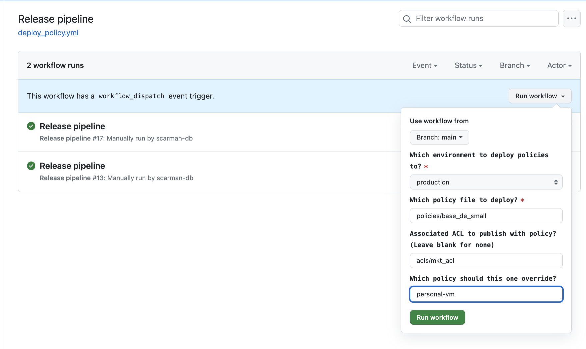

# Set up Git Workflow

## Add secrets for each of the environments (Repo-> Settigs -> Secrets & Variables)
* Namely:
*  DATABRICKS_PROD_HOST & DATABRICKS_PROD_TOKEN
*  DATABRICKS_TEST_HOST & DATABRICKS_TEST_TOKEN
*  DATABRICKS_DEV_HOST & DATABRICKS_DEV_TOKEN

## Set up Release pipeline

